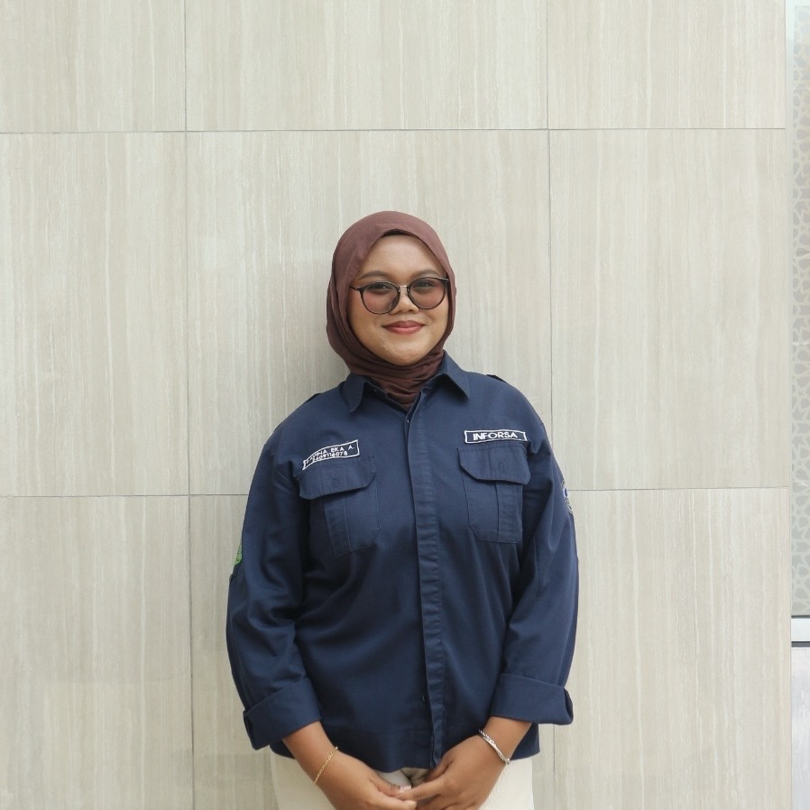
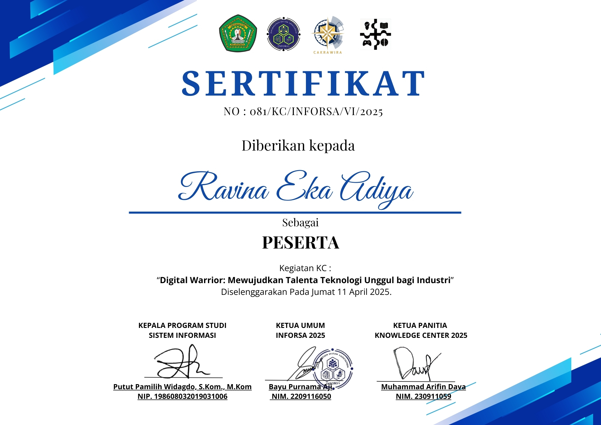
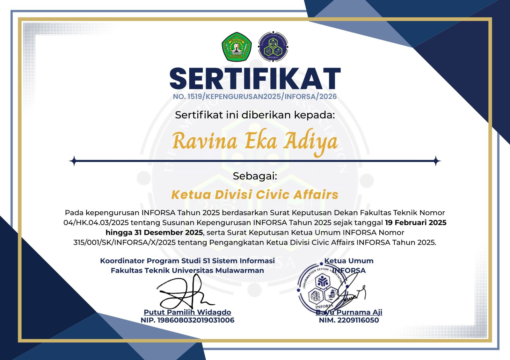
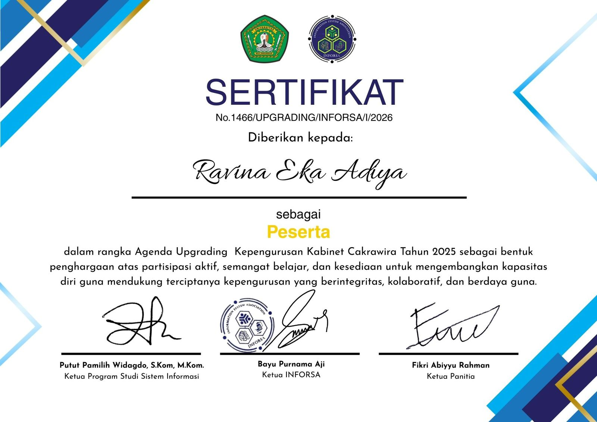

# Minpro - 1 - PBW

#### Nama : Ravina Eka Adiya
#### Nim : 2409116078
#### Kelas : Sistem Informasi B 24
#### Mata Kuliah : Pemrograman Berbasis Web
#

### Deskripsi Website
Website ini adalah website portofolio pribadi yang dibuat sebagai media pembelajaran dan pengembangan kemampuan dalam pembuatan website yang responsif dan menarik.
#

### Tampilan Website
#### 1. Section Navigation Bar
##### 
##### 
#

#### 2. Section Home
##### 
#

#### 3. Section About Me
##### 
#

#### 4. Section Certificates
##### 
#

### Penjelasan Kode
#### 1. Section Navigation Bar
```
<nav class="navbar navbar-expand-lg navbar-dark fixed-top custom-navbar">
    <div class="container">
      <a class="navbar-brand fw-bold" href="#home">Ravina Eka Adiya</a>

      <button class="navbar-toggler" type="button" data-bs-toggle="collapse" data-bs-target="#navbarNav">
        <span class="navbar-toggler-icon"></span>
      </button>

      <div class="collapse navbar-collapse" id="navbarNav">
        <ul class="navbar-nav ms-auto">
          <li class="nav-item"><a class="nav-link" href="#home">Home</a></li>
          <li class="nav-item"><a class="nav-link" href="#about">About Me</a></li>
          <li class="nav-item"><a class="nav-link" href="#certificates">Certificates</a></li>
        </ul>
      </div>
    </div>
  </nav>
 ```
Penjelasan : 
- Tag `<nav>` digunakan untuk membuat navigation bar dengan Bootstrap.
- fixed-top membuat navbar selalu berada di atas.
- navbar-toggler berfungsi sebagai tombol hamburger pada tampilan mobile.
- collapse navbar-collapse mengatur menu agar bisa buka/tutup.
- Tag `<ul>` dan Tag `<li>` berisi link navigasi ke setiap section (Home, About Me, Certificates).

```
.custom-navbar{
  background: linear-gradient(90deg, #ff9ecf, #ff6fb5);
  font-family: 'Baloo 2', cursive;
}

.navbar-brand,
.navbar-nav .nav-link{
  transition: all 0.3s ease;
  font-weight: 600;
}

.navbar-brand:hover,
.navbar-nav .nav-link:hover{
  transform: scale(1.08);
  text-shadow: 0 0 15px rgba(255,255,255,0.8),
               0 0 25px rgba(255,182,193,0.9);
}
```
Penjelasan :
- `.custom-navbar` digunakan untuk memberi warna gradasi pink pada navbar dan mengatur jenis font agar tampil lebih unik dan konsisten dengan tema.
- `.navbar-brand` dan `.nav-link` diberi efek transisi supaya perubahan saat hover terasa halus.
- Saat di-hover, teks akan sedikit membesar (scale) dan diberi efek glow menggunakan text-shadow agar terlihat lebih interaktif dan menarik.
#

#### 2. Section Home
```
<section id="home" class="home-section">
    <div class="section-decor"></div>

    <div class="container">
      <div class="row align-items-center">
        <div class="col-md-6 text-center mb-4 mb-md-0">
          
        </div>
        <div class="col-md-6 text-center text-md-start">
          <h1 class="home-title">Hallo, Saya Ravina</h1>
          <h4 class="home-subtitle mt-3">Mahasiswi Sistem Informasi</h4>
        </div>
      </div>
    </div>
  </section>
```
Penjelasan :
- `<section id="home">` digunakan sebagai bagian utama (hero section) yang menjadi tampilan pertama saat website dibuka.
- `section-decor` berfungsi sebagai elemen dekoratif background agar tampilan lebih menarik.
- `container` dan `row` dari Bootstrap digunakan untuk mengatur layout agar rapi dan responsif.
- `col-md-6` membagi tampilan menjadi dua kolom: kiri untuk foto profil dan kanan untuk teks perkenalan.
- `hero-img` digunakan untuk menampilkan foto profil dengan styling khusus.
- `home-title` dan `home-subtitle` digunakan untuk menampilkan nama dan deskripsi singkat dengan tampilan yang lebih menonjol.

```
.home-section{
  min-height: 100vh;
  padding: 120px 0;
  display: flex;
  align-items: center;
}

.hero-img{
  width: 340px;
  height: 340px;
  object-fit: cover;
  border-radius: 50%;
  border: 10px solid #ff9ecf;
  box-shadow: 0 0 30px rgba(255,111,181,0.5);
  transition: all 0.4s ease;
  animation: float 4s ease-in-out infinite;
}

.hero-img:hover{
  box-shadow: 0 0 85px rgba(255,105,180,0.9);
  transform: scale(1.06);
}

@keyframes float{
  0% { transform: translateY(0px); }
  50% { transform: translateY(-14px); }
  100% { transform: translateY(0px); }
}

.home-title{
  font-family: 'Baloo 2', cursive;
  font-size: 52px;
  color: #ff4fa3;
  font-weight: 700;
}

.home-subtitle{
  font-weight: 700;
  color: #444;
}

.home-desc{
  max-width: 520px;
  color: #555;
}

.btn-primary{
  background-color: #ff6fb5;
  border: none;
  border-radius: 30px;
  padding: 10px 25px;
  font-weight: 700;
}

.btn-primary:hover{
  background-color: #ff4fa3;
}
```
Penjelasan :
- `.home-section` membuat section setinggi layar dan rata tengah.
- `.hero-img` mengatur foto jadi lingkaran dengan efek glow dan animasi mengambang.
- `.home-title` dan `.home-subtitle` mengatur tampilan teks agar lebih menonjol.
- `.btn-primary` menyesuaikan warna dan bentuk tombol sesuai tema pink.
#

#### 3. Section About Me
```
<section id="about" class="py-5">
    <div class="section-decor"></div>

    <div class="container">
      <h2 class="text-center mb-5">About Me</h2>

      <div class="row g-4">
        <div class="col-md-6">
          <h4>Tentang Saya</h4>
          <p>
            Saya adalah mahasiswi yang suka belajar hal baru dan menikmati proses berkembang. Saya senang mencoba
            tantangan baru dan berusaha konsisten untuk jadi versi terbaik dari diri saya.
          </p>

          <h4 class="mt-4">Pengalaman</h4>
          <ul class="mb-0">
            <li>Bootcamp SMK se-Indonesia Tahun 2022</li>
            <li>Kepala Divisi Civic Affairs Departemen Relacs Kabinet Cakrawira</li>
            <li>Koordinator Konsumsi Inforsa Mengabdi Tahun 2025</li>
          </ul>
        </div>

        <div class="col-md-6">
          <h4>Skills</h4>

          <p class="mb-1">Public Speaking</p>
          <div class="progress mb-3">
            <div class="progress-bar" style="width: 80%">80%</div>
          </div>

          <p class="mb-1">Teamwork</p>
          <div class="progress mb-3">
            <div class="progress-bar" style="width: 90%">90%</div>
          </div>

          <p class="mb-1">Problem Solving</p>
          <div class="progress mb-3">
            <div class="progress-bar" style="width: 75%">75%</div>
          </div>

          <p class="mb-1">Time Management</p>
          <div class="progress">
            <div class="progress-bar" style="width: 85%">85%</div>
          </div>
        </div>
      </div>
    </div>
  </section>
```
Penjelasan :
- `<section id="about">` digunakan untuk menampilkan informasi tentang diri.
- Layout dibagi menjadi dua kolom: kiri untuk deskripsi dan pengalaman, kanan untuk daftar skill.
- `progress` dan `progress-bar` digunakan untuk menampilkan tingkat kemampuan dalam bentuk bar persentase.
- `container` dan `row` dari Bootstrap membantu mengatur tata letak agar responsif dan rapi.

```
.progress{
  height: 20px;
  border-radius: 20px;
  overflow: hidden;
  background-color: rgba(255,255,255,0.7);
}

.progress-bar{
  background-color: #ff6fb5 !important;
  font-weight: 700;
}
```
Penjelasan :
- `.progress` mengatur tinggi, sudut membulat, dan warna background bar agar terlihat lebih lembut.
- `.progress-bar` mengatur warna isi bar menjadi pink dan membuat teks persentase lebih tebal agar jelas terlihat.
#

#### 4. Section Certificates
```
<section id="certificates" class="py-5">
    <div class="section-decor"></div>

    <div class="container">
      <h2 class="text-center mb-5">Certificates</h2>

      <div class="row g-4">
        <div class="col-md-4">
          <div class="card certificate-card h-100 shadow-sm">
            
            <div class="card-body text-center">
              <h5 class="card-title">Kegiatan KC</h5>
              <p class="card-text">2025</p>
            </div>
          </div>
        </div>

        <div class="col-md-4">
          <div class="card certificate-card h-100 shadow-sm">
            
            <div class="card-body text-center">
              <h5 class="card-title">INFORSA</h5>
              <p class="card-text">2024</p>
            </div>
          </div>
        </div>

        <div class="col-md-4">
          <div class="card certificate-card h-100 shadow-sm">
            
            <div class="card-body text-center">
              <h5 class="card-title">Upgrading INFORSA</h5>
              <p class="card-text">2025</p>
            </div>
          </div>
        </div>
      </div>
    </div>
  </section>
```
Penjelasan :
- `<section id="certificates">` digunakan untuk menampilkan daftar sertifikat.
- Layout dibagi menjadi tiga kolom menggunakan Bootstrap agar responsif.
- Setiap sertifikat ditampilkan dalam bentuk `card` yang berisi gambar, judul, dan tahun.
- Class `certificate-card` digunakan untuk memberi efek styling dan animasi pada card.

```
.certificate-card{
  border: none;
  border-radius: 20px;
  transition: 0.3s;
  overflow: hidden;
}

.certificate-card img{
  width: 100%;
  height: auto;
  object-fit: contain;
  padding: 10px;
  background-color: #fff;
}

.certificate-card:hover{
  transform: translateY(-10px);
  box-shadow: 0 12px 30px rgba(255,111,181,0.35);
}
```
Penjelasan :
- `.certificate-card` menghilangkan border, membulatkan sudut, dan memberi efek transisi halus.
- Gambar diatur agar pas di dalam card dan memiliki background putih.
- Saat di-hover, card akan sedikit naik dan muncul efek bayangan agar terlihat lebih interaktif.
#

### Teknologi yang digunakan
1. HTML
2. CSS
3. Bootstrap
